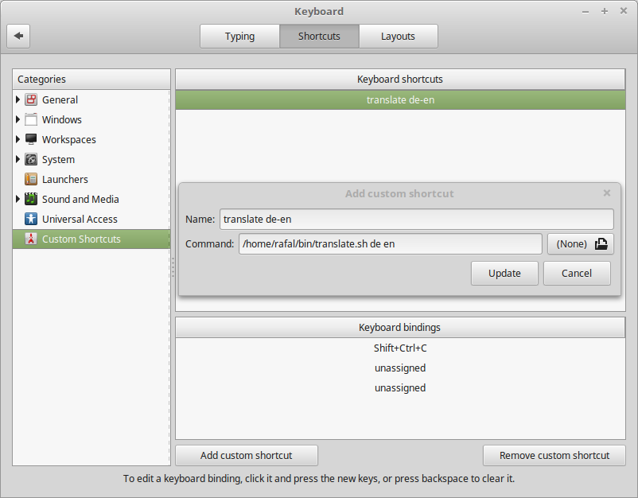

# linux-clipboard-translator

# How it works?

1) Select some text. (You can double click with left mouse button).

2) When you press key combination `Ctrl+Shift+C`, then:
  
* **Google Translate** website with translated text should be open in new web browser tab 
* or popup shows up in case of already searched word

3) open file `translated_words.txt` and note translation (note by yourself to memorize it). !! this could be improved !!

# Setup

1) Download script [translate.sh](translate.sh)

2) Run it in terminal to verify it works and that you have all dependencies installed.
E.g. `./translate.sh de en` should translate cliboard from German to English.

3) Configure shortcut for it. I am recommending the `Ctrl+Shift+C`, because it copies text to clipboard at the same time.

# Alternatives (Linux)

1) [goldendict](https://github.com/goldendict/goldendict) - Good, but doesn't support **Google Translate** (see issue [#105](https://github.com/goldendict/goldendict/issues/105))
